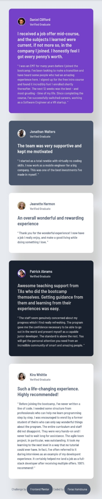
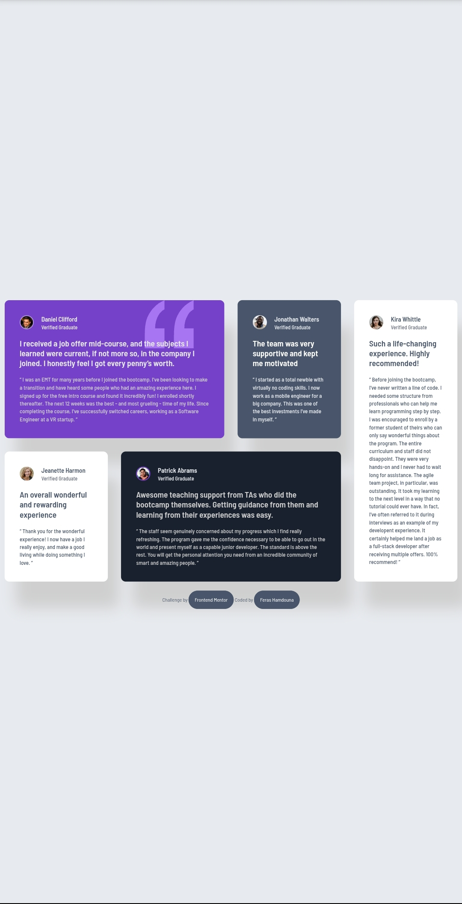

# Testimonials Grid Section Solution

This is a solution to the [Testimonials Grid Section challenge on Frontend Mentor](https://www.frontendmentor.io/challenges/testimonials-grid-section-Nnw6J7Un7).

## Table of contents

- [Overview](#overview)
  - [The challenge](#the-challenge)
  - [Screenshot](#screenshot)
  - [Links](#links)
- [My process](#my-process)
  - [Built with](#built-with)
- [Author](#author)

## Overview

### The challenge

Users should be able to:

- View the optimal layout for the testimonials section depending on their device's screen size.
- Experience a responsive design for both mobile and desktop.
- See clean, accessible, and semantic HTML structure.
- Enjoy a visually appealing grid-based layout.

### Screenshot

    
    

### Links

- Solution URL: [Frontend Mentor Solution](https://www.frontendmentor.io/solutions/responsive-testimonials-grid-using-css-grid-and-flexbox-ChCXYQ5DOz)
- Live Site URL: [Live Demo](https://ferashamdouna.github.io/testimonials-grid-section/)

## My process

### Built with

- Semantic HTML5
- CSS custom properties
- CSS Grid
- Flexbox
- Responsive design (Desktop-first workflow)

## Author

- GitHub - [@FerasHamdouna](https://github.com/FerasHamdouna)
- Frontend Mentor - [@FerasHamdouna](https://www.frontendmentor.io/profile/FerasHamdouna)
